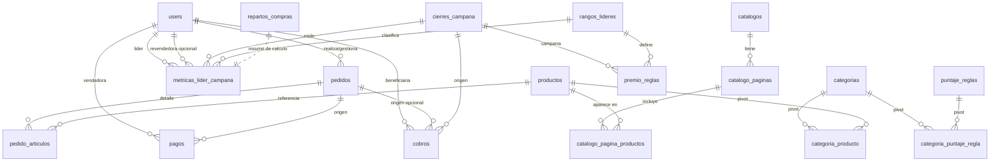
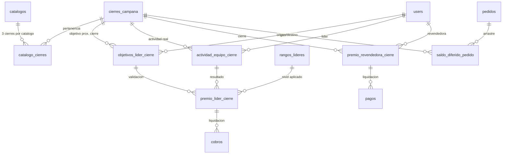

# Estructura visual de base de datos (estado actual vs propuesta V2)

Este documento muestra:

1. **La estructura actual** inferida desde migraciones vigentes.
2. **La estructura propuesta para V2** según el plan de catálogos, cierres, premios y seguimiento compartido.

> Nota: la sección V2 es una propuesta de implementación (todavía no migrada).

---

## 1) Estructura actual (migraciones ya existentes)

### Módulo comercial y catálogo

### Tablas actuales clave (resumen funcional)

- **Estructura temporal y comercial**
  - `catalogos` (catálogo general)
  - `cierres_campana` (campañas/cierres)
  - `pedidos` y `pedido_articulos`
- **Catálogo y reglas**
  - `productos`, `categorias`, `categoria_producto`
  - `puntaje_reglas`, `categoria_puntaje_regla`
- **Premios liderazgo**
  - `rangos_lideres`
  - `premio_reglas`
  - `repartos_compras`
  - `metricas_lider_campana`
- **Cobros/pagos diferidos**
  - `pagos` (vendedoras)
  - `cobros` (líderes/coordinadoras)

---

## 2) Estructura propuesta V2 (nueva implementación sugerida)

La propuesta V2 incorpora relaciones explícitas para calendario anual, seguimiento objetivo-vs-real y trazabilidad de premios por cierre.

### Tablas nuevas propuestas para V2

- `catalogo_cierres`
  - Relación explícita **catálogo ↔ 3 cierres**.
  - Campos sugeridos: `catalogo_id`, `cierre_campana_id`, `numero_cierre` (1..3), `mes`, `anio`.

- `objetivos_lider_cierre`
  - Guarda meta del próximo cierre: actividad objetivo, unidades objetivo y base de cálculo de plus.
  - Campos sugeridos: `lider_id`, `cierre_origen_id`, `cierre_objetivo_id`, `actividad_objetivo`, `unidades_objetivo`, `porcentaje_plus`.

- `actividad_equipo_cierre`
  - Fotografía operativa por líder: pedidos (actividad), unidades, auxiliares, cobranza, altas.
  - Campos sugeridos: `lider_id`, `cierre_campana_id`, `pedidos_equipo`, `unidades_validas`, `auxiliares`, `cobranza_ok`, `altas`.

- `premio_lider_cierre`
  - Resultado consolidado por líder y cierre con desglose por tipo de premio.
  - Campos sugeridos: `lider_id`, `cierre_campana_id`, `rango_lider_id`, `premio_actividad`, `premio_retencion`, `premio_altas`, `premio_cobranza`, `premio_crecimiento`, `premio_reparto`, `premio_plus_crecimiento`, `premio_unidades`, `premio_total`.

- `premio_revendedora_cierre`
  - Seguimiento de premios de revendedoras por cierres consecutivos y puntos acumulables.
  - Campos sugeridos: `revendedora_id`, `cierre_campana_id`, `pedidos_consecutivos`, `unidades`, `puntos_otorgados`, `puntos_acumulados`, `premio_programado_cierre_id`.

- `saldo_diferido_pedido`
  - Control de saldo a cobrar/pagar, balance, deuda y descuentos a cierres futuros.
  - Campos sugeridos: `pedido_id`, `cierre_origen_id`, `cierre_aplicacion_id`, `tipo_movimiento`, `monto`, `estado`.

---

## 3) Qué queda implementado hoy y qué pasa a backlog

### Ya existe hoy
- Base de catálogos, cierres, pedidos y artículos.
- Base de premios para liderazgo (rangos, reglas, métricas).
- Base de pagos/cobros diferidos.

### Se implementa en V2
- Vinculación formal de calendario anual (catálogo con sus 3 cierres).
- Objetivo al próximo cierre como entidad independiente.
- Retención y plus de crecimiento con trazabilidad explícita por cierre.
- Trayectoria de revendedora para premios consecutivos + puntos acumulables.
- Módulo de saldos diferidos con reglas de descuento a futuro.
